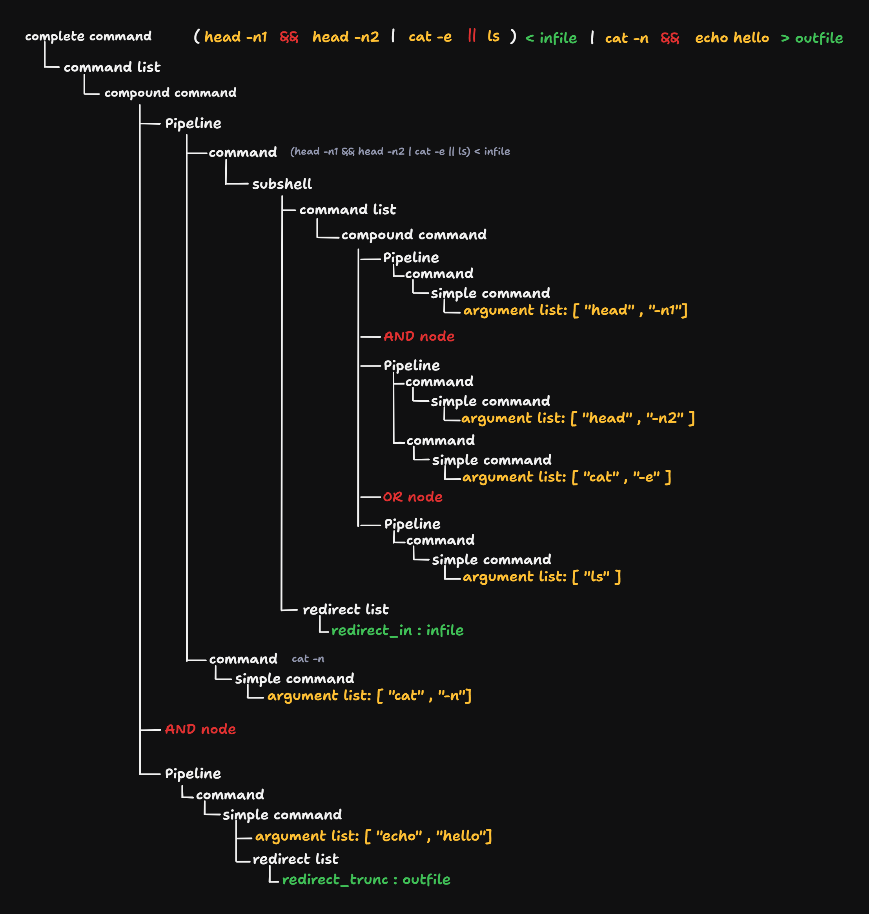

# Laying the Foundation: The Power of Good Code Design

When building a project as complex as a shell, good code design is not just helpful—it’s essential. Without a solid foundation, maintaining and expanding your project can quickly become a nightmare. In this section, we’ll explore key design principles that made the development of Minishell smoother, more maintainable, and less error-prone.

## The Importance of Code Structure

Minishell, like any other program, needs to be readable and organized. A well-structured project allows you to debug issues more easily, add new features without breaking existing functionality, and collaborate effectively with others. Two of the most crucial principles we adhered to in our design were:

### 1. Single Responsibility Principle (SRP)

Each function should have only one job. This might sound simple, but it’s one of the most overlooked principles in software design. When a function is responsible for multiple tasks, it becomes harder to test, debug, and reuse.

#### Example: Code Without SRP

```c
void process_file(const char *filename) {
    FILE *file = fopen(filename, "r");
    if (!file) return;
    
    char buffer[256];
    while (fgets(buffer, sizeof(buffer), file)) {
        // Process text
        for (int i = 0; buffer[i]; i++) {
            if (buffer[i] >= 'a' && buffer[i] <= 'z') {
                buffer[i] -= 32; // Convert to uppercase
            }
        }
        
        // Save output
        FILE *out_file = fopen("output.txt", "a");
        if (out_file) {
            fputs(buffer, out_file);
            fclose(out_file);
        }
    }
    fclose(file);
}
```

In this example, the function is doing too much:

- It reads the file.
- It processes the text.
- It writes the output.

This makes it difficult to modify any single part without affecting the rest.

#### Example: Code Using SRP

```c
void read_file(const char *filename, void (*process_line)(char *)) {
    FILE *file = fopen(filename, "r");
    if (!file) return;
    
    char buffer[256];
    while (fgets(buffer, sizeof(buffer), file)) {
        process_line(buffer);
    }
    fclose(file);
}

void convert_to_uppercase(char *buffer) {
    for (int i = 0; buffer[i]; i++) {
        if (buffer[i] >= 'a' && buffer[i] <= 'z') {
            buffer[i] -= 32;
        }
    }
}

void save_to_file(const char *filename, char *content) {
    FILE *file = fopen(filename, "a");
    if (file) {
        fputs(content, file);
        fclose(file);
    }
}

int main() {
    read_file("input.txt", convert_to_uppercase);
    save_to_file("output.txt", "Processed text\n");
    return 0;
}
```

Now, each function has a single responsibility:

- `read_file` handles file reading.
- `convert_to_uppercase` processes the text.
- `save_to_file` handles writing output.

This approach makes it easier to maintain and test each function independently.

### 2. Single Source of Truth (SSOT)

Bugs often occur when multiple parts of a program store the same data in different places. To avoid this, we establish a single source of truth for critical information. Instead of duplicating data across different modules, we centralize it in one place, ensuring consistency and reducing errors.

In a shell implementation like Minishell, lexemes play a crucial role in parsing and interpreting commands. If different parts of the program define or manipulate lexemes independently, inconsistencies can arise, making debugging difficult and leading to unexpected behavior. By centralizing lexeme definitions in a single module, we ensure that all components of the shell reference the same structure, avoiding duplication and maintaining coherence.

For example, having a dedicated lexer module that defines and processes lexemes ensures that any change to tokenization logic is applied consistently across the entire project. Without this centralization, one part of the program might classify a string differently than another, leading to parsing errors and inconsistent command execution.

## The Benefits of Good Code Design

By following SRP and SSOT, we achieved:

- **Easier debugging**: When something breaks, we know exactly where to look.
- **Better scalability**: Adding new features (like piping or job control) becomes much easier.
- **Improved readability**: Future contributors (or even your future self) can quickly understand the code.

With a well-structured design in place, we were ready to dive into the actual implementation of Minishell. Next, we’ll explore the project requirements and what was expected from us as developers.

## Further Reading

If you're interested in diving deeper into software design principles, here are some key concepts worth exploring:

- **Design Patterns**: Common solutions to recurring software design problems, such as Factory Pattern, Singleton Pattern, and Observer Pattern.
- **Behavioral Design Patterns**: Patterns that focus on communication between objects, such as Strategy Pattern, Command Pattern, and Chain of Responsibility.

Understanding and applying these concepts can further enhance your ability to write clean, maintainable, and scalable code.

---

# 1. Understanding the Minishell Project

Before diving into the implementation details, it is crucial to understand what the Minishell project entails. This section will outline the project’s requirements and what is expected from a developer tackling this challenge.

## Project Overview

Minishell is a simplified shell that mimics the behavior of Bash but with limited functionalities. The goal is to implement a command-line interpreter capable of executing basic shell commands while handling input, output, and built-in functions. It serves as an excellent introduction to system programming and process management.

## What Is Expected?

As a developer working on Minishell, you are expected to:

- Display a prompt when waiting for a new command.
- Have a working history.
- Search and launch the right executable (based on the PATH variable or using a
  relative or an absolute path).
- Not use more than one global variable. Think about it. You will have to explain
  its purpose.
- Not interpret unclosed quotes or special characters which are not required by the
  subject such as \ (backslash) or ; (semicolon).
- Handle ’ (single quote) which should prevent the shell from interpreting the metacharacters in the quoted sequence.
- Handle " (double quote) which should prevent the shell from interpreting the metacharacters in the quoted sequence except for $ (dollar sign).

- Implement redirections: 
  - `<` should redirect input.
  - `>` should redirect output. 
  - `<<` should be given a delimiter, then read the input until a line containing the delimiter is seen. However, it doesn’t have to update the history!
  - `>>` should redirect output in append mode.
- Implement pipes (| character). The output of each command in the pipeline is
  connected to the input of the next command via a pipe.
- Handle environment variables ($ followed by a sequence of characters) which
  should expand to their values.
- Handle $? which should expand to the exit status of the most recently executed
  foreground pipeline.
- Handle Signals : `Ctrl+C`, `Ctrl+D` and `Ctrl+\` which should behave like in bash.
- Your shell must implement the following builtins:
  - `echo` with option -n
  - `cd` with only a relative or absolute path
  - `pwd` with no options
  - `export` with no options
  - `unset` with no options
  - `env` with no options or arguments
  - `exit` with no options
- Bonus part:
  - `&&` and `||` with parenthesis for priorities.
  - Wildcard `*` should work for the current working directory

This project isn’t just about making a functional shell—it’s about building one that is well-structured, efficient, and easy to maintain. Knowing the goals from the start helps in designing a solid foundation before coding. In this blog, we’ll walk through the steps we took to complete the project, including the bonus part. Here are the steps:

1. **Understanding Shell Grammar**
2. **Parsing user input and building the AST**
3. **Execution: AST traversal and redirections handling**
4. **Environment Variable and Wildcard expansions**.
5. **Builtin commands**.
6. **Signal handling**.
7. **Error management.**

# 2. Understanding shell grammar

Source: **IEEE Std 1003.1**, [opengroup.org - Shell Command Language](https://pubs.opengroup.org/onlinepubs/009695399/utilities/xcu_chap02.html)

​	Imagine you have a big box of LEGO bricks. You can use them to build anything—a house, a car, or even a spaceship! But if you just stick random bricks together without a plan, your creation might fall apart or not look like anything at all. Grammar is like the instructions for building with LEGOs. It tells you how to put the pieces (words) together in the right way so that your creation (a sentence) makes sense. If you follow the rules, you can build something strong and clear. But if you don’t, your words might get jumbled, and people won’t understand what you’re trying to say!

Just like how LEGO instructions guide you in building something sturdy, grammar rules define how shell commands should be structured. A parser acts like a LEGO master builder—it checks if the pieces (words and symbols) are put together correctly according to the instructions. If you randomly connect LEGO bricks without following the rules, your structure might collapse. Similarly, if a command doesn’t follow the correct syntax, the parser should catch the mistake and prevent the shell from executing something invalid. 

A well-designed parser doesn’t just hardcode specific mistakes; instead, it understands the deeper rules of how commands should be formed. This way, it can detect errors naturally, rather than relying on checking for every possible mistake separately.

Understanding grammar is essential for building the parser. Here is a simplified version of Shell grammar that aligns with the Minishell project requirements:

``` 
complete_command : linebreak command_list linebreak
command_list     : compound_command linebreak command_list
			    | compound_command
                 ;
compound_command : pipeline '&&' linebreak compound_command
                 | pipeline '||' linebreak compound_command
			    | pipeline
                 ;
pipeline         : command '|' linebreak pipeline
                 | command
                 ;
command          : subshell
			    | simple_command
                 ;
subshell         : '(' command_list ')' redirect_list*
                 ;
simple_command   : io_redirect simple_command
			    | io_redirect
                 | WORD        simple_command
                 | WORD
                 ;
redirect_list    : io_redirect redirect_list*
                 ;
io_redirect      : '<'     WORD(filename) 
                 | '>'     WORD(filename)
                 | '>>'    WORD(filename)
                 | '<<'    WORD 		
			    ;
linebreak        : NEWLINE* linebreak*
```

Here’s a step-by-step breakdown of the above mentioned grammar, starting from the **complete_command** down to the **WORD** token:  

1. **complete_command**:  
   - This represents a full shell command.  
   - It consists of a **command_list** surrounded by optional **linebreaks** (which handle newlines and formatting). 
2. **command_list**:  
   - A list of commands that need to be executed.  
   - It consists of at least one **compound_command**, followed by an optional additional **command_list** (allowing for multiple commands to be chained together).  
3. **compound_command**:  
   - This handles command execution logic, particularly logical operators:  
     - `&&`: Execute the next command only if the previous one succeeds.  
     - `||`: Execute the next command only if the previous one fails.  
   - A command can be a **pipeline** (explained next), optionally followed by `&&` or `||`, allowing for conditional execution chains.  
4. **pipeline**:  
   - Defines how commands are linked using pipes (`|`).  
   - A **command** can be followed by `|` to pass its output to the next command in the pipeline.  
   - If no pipe is present, it’s just a single command.  
5. **command**:  
   - A **command** can either be:  
     - A **subshell** (a group of commands inside parentheses that execute in a separate environment).  
     - A **simple_command** (a basic shell command with optional arguments or redirections).  
6. **subshell**:  
   - A command group enclosed in parentheses `()`.  
   - This allows commands to be executed in a separate process.  
   - A **redirect_list** may optionally follow, meaning input/output redirection applies to the entire subshell.  
7. **simple_command**:  
   - The most basic command structure.  
   - It consists of:  
     - An optional **io_redirect** (handling input/output redirection).  
     - One or more **WORD** tokens (representing the command name and arguments).  
8. **redirect_list**:  
   - A sequence of **io_redirect** rules.  
   - Allows multiple redirections to be attached to a command (e.g., `command > file 2>&1`).  
9. **io_redirect**:  
   - Specifies how input and output are handled.  
   - Examples:  
     - `< file` (read input from a file).  
     - `> file` (write output to a file, overwriting).  
     - `>> file` (append output to a file).  
     - `<< WORD` (here-document, where input is provided inline).  
10. **linebreak**:  
    - Handles newlines (`NEWLINE*`).  
    - Ensures that multiple blank lines don’t break the parsing process.  
11. **WORD**:  
    - The most fundamental unit.  
    - Represents command names, arguments, filenames, or here-document delimiters.  

## **Why This Structure Matters**  

- This grammar is **hierarchical**, meaning larger structures are built from smaller components.  
- The use of recursion (e.g., `command_list → compound_command → pipeline → command`) allows the parser to handle complex commands without manually listing all edge cases.  
- Instead of hardcoding syntax checks, this structured approach naturally enforces correct shell command syntax while allowing flexibility.

# 3. Parsing user input and building the AST

When a shell processes a command, it follows a structured process: first, it **breaks the input into lexemes**, then **converts them into tokens**, and finally **builds an Abstract Syntax Tree (AST)** to understand the command's structure. Let’s go step by step through these concepts.

---

## 1. What is a Lexeme?  

A **lexeme** is the smallest unit of meaning in a command. It is a sequence of characters grouped together based on **syntactic rules**. Lexemes are not yet classified but are simply raw fragments of input.

For example, in a shell command like:  

```
ls -l | grep txt > output.txt
```

The raw lexemes would be:  

```
"ls", "-l", "|", "grep", "txt", ">", "output.txt"
```

At this stage, they are just character sequences that need classification.

---

## 2. What is a Tokenizer? 

A **tokenizer (or lexer)** processes lexemes and classifies them into **tokens**. A **token** is a structured representation of a lexeme, attaching meaning to it.  

For instance, after tokenization, we might classify lexemes as:  

- `"ls"` → **WORD** (a command)  
- `"-l"` → **WORD** (an argument)  
- `"|"` → **PIPE** (an operator)  
- `"grep"` → **WORD**  
- `"txt"` → **WORD**  
- `">"` → **REDIRECTION**
- `"output.txt"` → **WORD (redirection target)**  

The tokenizer ensures that the shell **understands what each piece of input represents**, so the parser can process it logically.

---

## 3. What is an Abstract Syntax Tree (AST)? 

An **Abstract Syntax Tree (AST)** is a structured tree representation of the command’s meaning. Each node represents an **operation or a component**, while the edges define **the relationships** between them.  

The AST is crucial because:  

- It establishes the correct **execution order** of commands.  
- It **groups related components** logically (e.g., separating redirections from pipelines).  
- It **avoids ambiguity** by following strict grammar rules.

In building our AST, we took an **N-ary tree approach** rather than a binary one, allowing greater flexibility in representing complex shell commands. Instead of structuring the tree as a series of binary operations (where each operator has only two children), our AST nodes can have multiple children depending on their type. For example, a **pipeline node** doesn’t just link two commands at a time but holds a **list of command nodes** as children. This makes parsing more intuitive and execution more efficient. For instance, the command:  

```bash
ls | cat -e | wc -l
```

would be represented as a **pipeline node** with a **list of three command nodes**: `[ls, cat -e, wc -l]`. This structure ensures that parsing and execution remain **consistent and scalable**, as it allows us to naturally extend the tree for multiple piped commands, logical operators, and redirections without unnecessary nesting or complex tree traversal logic.

another complex example:

```bash
(head -n1 && head -n2 | cat -e || ls) < infile | cat -n && echo hello > outfile
```



The given AST follows the structured grammar we discussed earlier, allowing us to parse and execute the command correctly. It starts with the entry point **complete_command**, which leads to a **command_list** and then a **compound_command**. This **compound_command** contains two **Pipelines** separated by an AND operator.

The first **Pipeline** contains a single **command node**, which is a **subshell** `( ... )`. This subshell groups multiple commands together while applying an **input redirection (`< infile`)** to the entire group. Inside the **subshell**, we see recursion as the grammar returns to the **command_list** step to further break down the commands inside the parentheses. The **command_list** inside the subshell consists of a **compound_command** containing two **Pipelines** separated by an **AND operator (`&&`)**.

The first **Pipeline** inside the subshell contains a single **simple command node** representing `head -n1`, which is a leaf node since it consists only of an argument list. The **AND operator (`&&`)** ensures that if `head -n1` succeeds, the second **Pipeline** executes. This second **Pipeline** consists of two **command nodes**:

- The first **command node** is another **simple command** representing `head -n2`.
- The second **command node** is `cat -e`, which receives input through the **Pipeline operator (`|`)**.

Following the **AND and OR logic**, if the second **Pipeline** fails, the **OR node (`||`)** ensures that `ls` executes as an alternative command.

Once the **subshell** is fully parsed, the AST moves back to the main **Pipeline**, where the output of the subshell is passed into `cat -n` via the **Pipeline operator (`|`)**. Finally, we encounter another **AND node (`&&`)**, which ensures that if `cat -n` succeeds, the last **Pipeline** executes. This last **Pipeline** contains a **simple command node** representing `echo hello`. This **simple command** is a leaf node since it contains only an argument list and an **output redirection (`> outfile`)**, ensuring that its output is written to a file.

By following the structured grammar, the AST naturally enforces correct execution order, ensuring each command and operator is processed according to shell semantics.

# 4. Execution: AST traversal and redirections handling

## Executing the Parsed AST: Key Concepts  

Once the shell command is parsed into an **Abstract Syntax Tree (AST)**, the next step is execution. This involves **traversing the AST**, handling operators (`&&`, `||`, `|`), managing processes, and ensuring correct data flow between commands. Below are the fundamental system calls and concepts required to execute a shell command properly.  

---

### 1. Traversing the AST for Execution  

- Execution starts from the root node (`complete_command`) and follows the grammar structure.  
- **Logical operators (`&&`, `||`)** determine whether the next command executes based on exit status.  
- **Pipelines (`|`)** ensure that the output of one command becomes the input of the next.  

---

### 2. Key System Calls for Execution

#### Process Creation (`fork`) 

- The shell **creates a child process** using `fork()`.  
- The **child process** executes the command, while the **parent waits** for it to finish.  
- If the command is part of a pipeline, multiple child processes are created and connected via pipes.  

#### Executing Commands (`execve`)  

- The child process replaces itself with the target program using `execve()`.  
- `execve()` loads and runs the command (e.g., `/bin/ls`), replacing the child’s memory with the new program.  

#### Waiting for Child Processes (`wait`, `waitpid`) 

- The parent process waits for a child process to **finish executing** using `wait()` or `waitpid()`.  
- Using `wait()` or `waitpid()` we can get the **exit status** of the child process, which determines whether subsequent commands (like in `&&` or `||`) will execute.  
- The **exit status** is stored in an integer and extracted using `WEXITSTATUS(status)`, which gives the return code of the command (0 for success, non-zero for failure).

#### Exit Status & Logical Operators

- **`&&` (AND):** The next command runs **only if** the previous command’s exit status is `0` (success).  
- **`||` (OR):** The next command runs **only if** the previous command’s exit status is **non-zero** (failure).  

---

### 3. Handling Pipelines (`|`)  

- `pipe()` creates a unidirectional **data channel** between two processes.  
- Before calling `execve()`, `dup2()` is used to **redirect stdout** of one process into the **stdin** of the next. 
- The **exit status of a pipeline** is always the **exit status of the last command** in the pipeline.  

Example:  

```bash
ls | grep txt | wc -l
```

- `ls` outputs to `grep`, `grep` outputs to `wc -l`.  
- The shell only considers the **exit status of `wc -l`** for logical operators (`&&`, `||`).  

---

### 4. Handling Redirections (<, >, >>)
   In a shell, redirections are processed from left to right, modifying the standard input (stdin) or standard output (stdout) of a command before execution. Input redirections (<, <<) affect stdin, meaning the command reads from the specified file or heredoc instead of the terminal. Output redirections (>, >>) affect stdout, sending command output to a file rather than displaying it. If multiple redirections appear in a command, they are applied sequentially in order. For example:

```sh
cat < infile > outfile
```

Here, `infile` is set as stdin, then stdout is redirected to `outfile`. However, in:

```sh
cat > outfile < infile
```

stdout is redirected first, followed by stdin. Understanding this left-to-right evaluation ensures correct command execution without unintended behavior.

#### Complex Redirection Example

Let's construct a more advanced command that includes:

- Multiple input redirections (`<`, `<<`)
- Multiple output redirections (`>`, `>>`)
- Usage of `/dev/stdin` and `/dev/stdout`

#### Example Command:

```sh
command < input1 <<EOF1 < /dev/stdin >> output1 > output2 >> /dev/stdout <<EOF2
some text for heredoc 1
EOF1
some text for heredoc 2
EOF2
```

#### Step-by-Step Redirection Processing (Left to Right)

1. `< input1` → Redirects stdin to read from `input1`.
2. `<<EOF1` → Starts a heredoc with the delimiter `EOF1`, overriding stdin.
3. `< /dev/stdin` → Redirects stdin to `/dev/stdin`. Since redirections are processed sequentially, `/dev/stdin` will be the last stdin file which is the heredoc.
4. `>> output1` → Redirects stdout, appending output to `output1`.
5. `> output2` → Redirects stdout with truncation, overriding the previous stdout.
6. `>> /dev/stdout` → Redirects stdout to `output2` with append since `/dev/stdout` refers to the last stdout file which is `output2`.
7. `<<EOF2` → Another heredoc with the delimiter `EOF2`, overriding stdin again.

#### Final Effect:

- Stdin is ultimately set to the second heredoc, because heredocs override previous input redirections.
- Stdout is ultimately redirected to `output2` with append, because when opening /dev/stdout with append mode  it was referring to the last duped stdout which was `output2`.

This example demonstrates how redirections are applied sequentially and how the shell handles file descriptor operations in a structured manner to maintain consistency in input and output redirection. in general redirection handling follows these steps:

- Open the redirection path ( filename or create heredoc ).
- Apply the redirection type (in, out or append) ( in C we can use dup or dup2 ).
- Move to the next redirection. ( left-to-right ).


  **Note:**

  ​	Here-document redirection (**<<** delimiter) is processed immediately when encountered, while building the AST and before command execution. This behavior is demonstrated in the following example, where a syntax error occurs.

  ``` bash
  cat << EOF ()&&
  ```

  ```bash
  inajah:~$ cat << EOF () &&
  > this is the here-doc running
  > but the command has a syntax error
  > EOF
  -bash: syntax error near unexpected token `('
  ```

#### Subshell Redirection Handling

When using a subshell, all commands inside the parentheses share the same redirection context. For example:
```bash
(head -n1 && head -n1) < infile < infile2 > outfile
```
Step-by-Step Execution:
  1. < infile → Redirects stdin to infile.
  2. < infile2 → Redirects stdin to infile2, overriding the previous redirection.
  3. \> outfile → Redirects stdout to outfile, truncating the file.

Since the entire command inside () runs in a subshell, all commands within the parentheses inherit the same redirections. This means both `head -n1` commands will read from infile2 (the final stdin redirection) and write to outfile. The shell applies the redirections before executing the subshell, ensuring a consistent input/output environment for all commands within it.

---

### 5. Subshell Execution  

- When encountering a **subshell (`command_list`)**, the shell **forks a new child process**.  
- The **subshell executes independently**, and its **exit status** determines subsequent command execution.

## 4. Environment Variable and Wildcard expansions: 

According to **IEEE Std 1003.1**, [opengroup.org - Shell Command Language](https://pubs.opengroup.org/onlinepubs/009695399/utilities/xcu_chap02.html), expansion happens in four steps:

- Parameter expansion
- Field splitting
- Pathname expansion
- Quote removal
